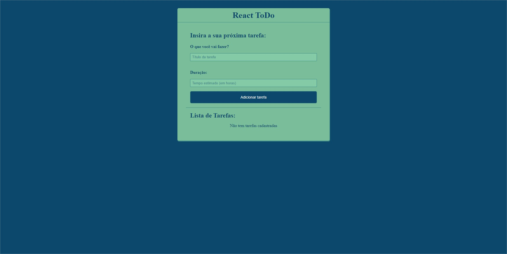

# Começando o meu aprendizado em ReactJS 
Criei uma lista de tarefas, baseada no video do canal Hora de Codar do Matheus Battisti

Link do video: https://www.youtube.com/watch?v=pOVyVivyfok

O projeto permite você adicionar tarefas, junto com o tempo de duração. Com as tarefas cadastradas, é possivel marcar elas como feita ou exclui-las

Para iniciar o projeto e roda-lo em seu navegador, você precisa rodar em 2 terminais distintos:

->npm run server

->npm start

